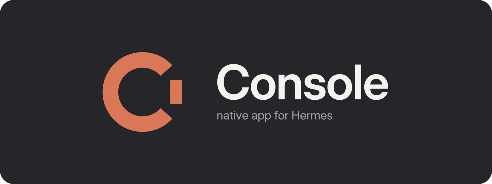

<p align="center">
  <a href="https://hermes.xpetalab.dev">
    
  </a>
</p>

<p align="center">
  A private, Android-first console for the self-hosted Hermes Agent you control.
</p>

<p align="center">
  <a href="https://play.google.com/store/apps/details?id=dev.xpetalab.hermesconsole"></a>
  <a href="https://hermes.xpetalab.dev/obtainium/"></a>
</p>
<p align="center">
  <a href="https://ko-fi.com/xpeta"></a>
</p>

<p align="center">
  <a href="https://hermes.xpetalab.dev"></a>
  <a href="LICENSE"></a>
  
</p>

<p align="center">
  <a href="docs/README_ES.md">Español</a> ·
  <a href="docs/INSTALLATION.md">Installation</a> ·
  <a href="docs/CONFIGURATION.md">Server setup</a> ·
  <a href="docs/PRIVACY_POLICY.md">Privacy</a> ·
  <a href="SECURITY.md">Security</a>
</p>

Hermes Console is an independent Flutter client for
[Hermes Agent](https://github.com/NousResearch/hermes-agent). It brings chat,
Bots, operations, approvals and Voice to Android without putting an XPeta Lab
account or analytics service between your phone and your server.

> Hermes Console is a client, not an AI provider. You need a compatible Hermes
> Agent instance and any model-provider access required by that instance.

## What you can do

| Surface | Native Android experience |
|---|---|
| Conversations | Streaming Markdown and code, attachments, generated images, session history and model selection. |
| Bots | Profiles, Blobatar identities, mentions, rooms, tasks and activity kept separate from normal conversations. |
| Operations | Runs and approvals, Cron, Kanban, skills, memory, models, artifacts and capability-aware admin tools. |
| Voice | Dictation plus a dedicated conversation mode with phone or Hermes-server speech routes and explicit fallbacks. |
| Android | App Lock, read-only instances, notifications, widgets, share sheet, QR pairing and connection diagnostics. |
| Privacy | No XPeta Lab telemetry, no advertising SDK and credentials protected with Android Keystore. |

The app follows Hermes Desktop and Hermes Agent as the protocol contract. A
feature is shown only when the connected server exposes the capability it
needs; older servers degrade without inventing endpoints.

## See it in action

<table>
  <tr>
    <td align="center"><strong>Conversations</strong></td>
    <td align="center"><strong>Kanban</strong></td>
    <td align="center"><strong>Tools</strong></td>
  </tr>
  <tr>
    <td></td>
    <td></td>
    <td></td>
  </tr>
  <tr>
    <td align="center"><strong>Terminal</strong></td>
    <td align="center"><strong>Scheduled tasks</strong></td>
    <td align="center"><strong>Documents</strong></td>
  </tr>
  <tr>
    <td></td>
    <td></td>
    <td></td>
  </tr>
</table>

The gallery uses the approved public demo set with fictional data. Screens may
vary slightly by app version and by the capabilities exposed by your Hermes
server.

## Install

### Google Play

[Install the production package from Google Play](https://play.google.com/store/apps/details?id=dev.xpetalab.hermesconsole).
The package ID is `dev.xpetalab.hermesconsole` and Play builds use Play App
Signing.

### Obtainium

After the first signed GitHub release is published, Obtainium can follow the
release feed directly:

1. Install [Obtainium](https://github.com/ImranR98/Obtainium).
2. Use **[Add Hermes Console to Obtainium](https://hermes.xpetalab.dev/obtainium/)**.
   The button opens Obtainium's Add App screen with the official repository
   already filled in.
3. Confirm that the detected source is **GitHub Releases** and review the APK
   signature before installing.

If Android blocks the hand-off, open **Add App** in Obtainium and paste
`https://github.com/xP3ta/hermes-console` manually.

The Obtainium path and Google Play path are alternative update channels for
the same production package; do not switch between signatures without first
checking the published migration notes.

### Direct APK

Only install a production APK attached to an official
[GitHub release](https://github.com/xP3ta/hermes-console/releases). Verify its
version, SHA-256 digest and signing certificate. `qa`, `debug` and `profile`
artifacts are internal test builds and are never public releases.

## Connect your Hermes server

1. Install and configure
   [Hermes Agent](https://github.com/NousResearch/hermes-agent) on a server you
   control.
2. Reach it from Android over HTTPS, LAN or a private network such as
   [Tailscale](https://tailscale.com). Do not expose unauthenticated admin
   services to the public internet.
3. Open Hermes Console and choose **Connect server**.
4. Scan the pairing QR/link generated by your server, or enter the Gateway and
   optional Dashboard details manually.
5. Run the built-in capability check before saving the instance.

Gateway credentials are not model-provider keys. Pairing links and QR codes
may contain access details; treat them as secrets and never attach them to a
public issue. See the complete [configuration guide](docs/CONFIGURATION.md).

## Voice, without hidden provider defaults

Hermes Console keeps dictation and Voice conversation separate:

- **On this phone** uses private on-device STT/TTS after an explicit model
  download. It works without Google services once prepared.
- **Hermes server** is opt-in per server identity and profile. Audio goes to
  the self-hosted Dashboard endpoints and uses the speech providers configured
  there.

No paid provider, personal model, language or server address is hard-coded as
a global default. An explicitly selected route fails visibly instead of
silently sending audio somewhere else.

### Experimental: GPT-Live voice

Voice settings has an opt-in **GPT-Live voice (experimental)** switch. It is
off by default and only works when the connected Hermes server runs
`voice.voice_chat_mode: gpt-live` with an OpenAI key configured **on the
server**. The phone never holds that key: it sends its WebRTC offer to the
Dashboard (`POST /api/audio/voice-live/session`) and talks to the voice model
with the answer the server returns. When the server reports GPT-Live as
unavailable, Voice falls back to the turn-based mode with a notice.

During a live session, saying "stop talking" (or "silence", "be quiet",
"enough"; "cállate", "para de hablar", "basta" in Spanish) interrupts the
current reply and keeps listening. Saying "stop" on its own or "end the
conversation" ("termina la conversación") ends the session. Console never
closes a live session because nobody spoke; the vendor's own session limits
apply and are outside the app's control.

## Build from source

Required toolchain: Flutter 3.47.x, its bundled Dart SDK, Java 17 and Android
SDK 36.

```bash
flutter pub get
flutter analyze
flutter test
flutter build apk --debug --flavor full \
  --dart-define=HERMES_FLAVOR=full \
  --dart-define=HERMES_LOCAL_AGENT=true
```

The debug build is for development only. Release builds deliberately fail
without signing configuration stored outside the repository. Read
[release and distribution](docs/RELEASE_DISTRIBUTION.md) before producing an
APK or AAB.

## Project structure

```text
lib/             Flutter UI, state and Hermes clients
android/         Android integration, flavors, widgets and permissions
assets/bridge/   Optional Mobile Bridge helper
docs/            Setup, architecture, privacy, security and release policy
test/            Unit and widget regression suites
```

## Privacy and security

- No advertising, analytics or XPeta Lab-operated conversation proxy.
- Secrets are stored with Android Keystore through `flutter_secure_storage`.
- Remote destinations are the instances and optional providers the user
  configures.
- Cleartext access is limited to development/private-network cases documented
  by the project; HTTPS or a private VPN is recommended.

Report vulnerabilities privately using [SECURITY.md](SECURITY.md). Do not put
credentials, real conversations, server topology or pairing payloads in a
public issue.

## Contributing

Focused contributions are welcome. Start with
[CONTRIBUTING.md](CONTRIBUTING.md) and the
[Code of Conduct](CODE_OF_CONDUCT.md), preserve third-party notices, and run
the complete test and analysis gates before opening a pull request.

## License and independence

Original Hermes Console source code is licensed under
[GNU GPL version 3.0 only](LICENSE) (`GPL-3.0-only`). Portions derived from
`rusty4444/hermes-android` retain their MIT notice. Dependencies, models,
fonts and artwork retain their own terms; see [NOTICE](NOTICE) and
[THIRD_PARTY_NOTICES.md](THIRD_PARTY_NOTICES.md). Checksums and provenance for
project artwork are recorded in [ASSET_PROVENANCE.md](ASSET_PROVENANCE.md).
The final source, dependency and binary checks are tracked transparently in the
[open-source release checklist](docs/OPEN_SOURCE_RELEASE_CHECKLIST.md).

Hermes Console is maintained by [XPeta Lab](https://hermes.xpetalab.dev) as an
independent project. It is compatible with Hermes Agent but is not affiliated
with, sponsored by or endorsed by Nous Research.
